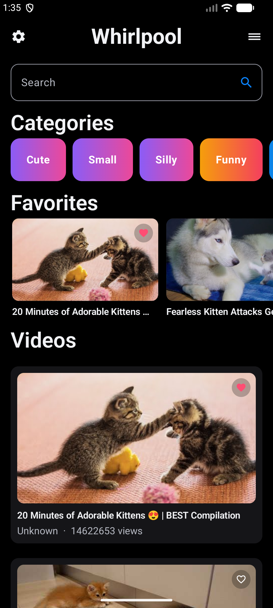
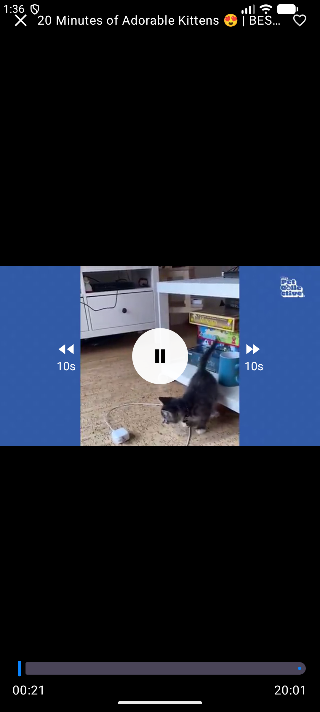
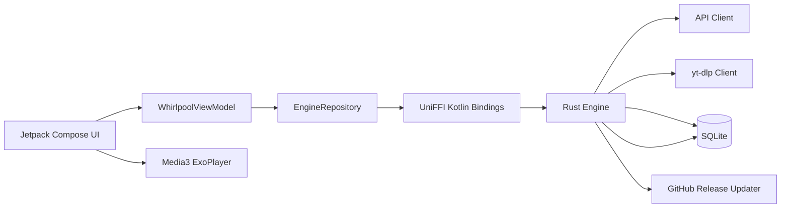

# Whirlpool

<p align="center">
  <strong>Community-driven Hottub video player powered by a Rust engine via UniFFI for Android.</strong>
</p>

<p align="center">
  
  
  
  
  
  
</p>

<p align="center">
  
  
</p>

## Installation

If you already have an APK build artifact, install it directly:

```bash
adb install -r app-debug.apk
adb shell am start -n com.whirlpool.app/.MainActivity
```

## Build from source

### 1. Prerequisites

- Rust toolchain (1.75+)
- Android SDK + NDK
- `cargo-ndk`
- Android Studio / Gradle environment
- Optional runtime support: Python + `curl-cffi`

### 2. Generate UniFFI Kotlin Bindings

```bash
scripts/generate_uniffi_kotlin.sh
```

Generates Kotlin bridge sources into:

- `app/src/main/java/com/whirlpool/engine/`

### 3. Build Android Native Libraries

```bash
scripts/build_android_libs.sh
```

Builds `.so` files for:

- `arm64-v8a`
- `x86_64`

and outputs into:

- `app/src/main/jniLibs/`

### 4. Build and install the app

```bash
./gradlew :app:assembleDebug
adb install -r app/build/outputs/apk/debug/app-debug.apk
adb shell am start -n com.whirlpool.app/.MainActivity
```

## What This Project Is

Whirlpool is a native Android app with:

- A **Rust core engine** (`rust/engine`) for discovery, resolution, caching, favorites, and DB import/export.
- A **Kotlin + Jetpack Compose UI** (`app`) for browsing and playback.
- A **UniFFI bridge** that exposes Rust data models and engine methods to Kotlin.

The app uses:

- `POST /api/status` to load server metadata and channel definitions.
- `POST /api/videos` (`/api/video` fallback) using the selected/default channel from status.
- `yt-dlp` extraction for stream resolution.
- `curl-cffi` bridge support for anti-bot browser impersonation workflows.
- Rust-owned SQLite as the single source of truth.

## Architecture



## Tech Stack

| Layer | Tech |
|---|---|
| Core | Rust 1.75+, Tokio, Reqwest, Rusqlite |
| FFI Bridge | UniFFI (Kotlin bindings) |
| Android UI | Kotlin, Jetpack Compose, Material3 |
| Video Playback | Android Media3 / ExoPlayer |
| Persistence | SQLite (managed in Rust) |
| Build Tooling | cargo-ndk, Gradle, Android SDK/NDK |

## Repository Layout

```text
.
├── app/                    # Android app (Compose + Media3)
├── rust/engine/            # Rust core engine (UniFFI exports)
├── scripts/                # Build/generation/log helpers
├── Setup.md                # Detailed setup and linking notes
└── Agents.md               # Architecture and bridge notes
```

## Rust <-> Kotlin Bridge Map

Rust `Engine` exports these primary methods to Kotlin:

- `sync_status()`
- `discover_videos(query, page, limit)`
- `resolve_stream(page_url)`
- `list_favorites()`, `add_favorite(video)`, `remove_favorite(video_id)`
- `export_database(path)`, `import_database(path)`
- `check_yt_dlp_update()`, `run_yt_dlp_update()`
- `bridge_health()`

Main bridged data objects:

- `EngineConfig`
- `StatusSummary`
- `VideoItem`
- `ResolvedVideo`
- `FavoriteItem`
- `YtDlpUpdateInfo`
- `BridgeHealth`

## Discovery Flow

Whirlpool video discovery follows this sequence:

1. `POST /api/status`
2. Read `channels[]` from response and pick the default/active channel
3. `POST /api/videos` with JSON payload:
   - `channel`
   - `sort`
   - `query`
   - `page`
   - `perPage`
4. Treat each element in `items[]` (or `videos[]`) as one video record

## Testing and Runtime Diagnostics

Run Rust tests:

```bash
cargo test -p whirlpool_engine
```

Logcat flow for JNI / FFI / Rust panic checks:

```bash
adb logcat -c
# run and interact with app
adb logcat -d | rg -i "(rust|panic|jni|nativeactivity|uniffi|ffi)"
```

Or use helper:

```bash
scripts/logcat_check.sh
```

## Runtime Config Notes

Current default API base URL is configured in:

- `app/src/main/java/com/whirlpool/app/data/EngineRepository.kt`

Current value:

- `https://getfigleaf.com`

Database path lives inside Android app sandbox (`files/shared/whirlpool.db`) and is only read/written by Rust.

## Documentation

- Setup guide: `Setup.md`
- Architecture and bridge notes: `Agents.md`

## License

Add your project license here (for example, MIT, Apache-2.0, or dual-license).
